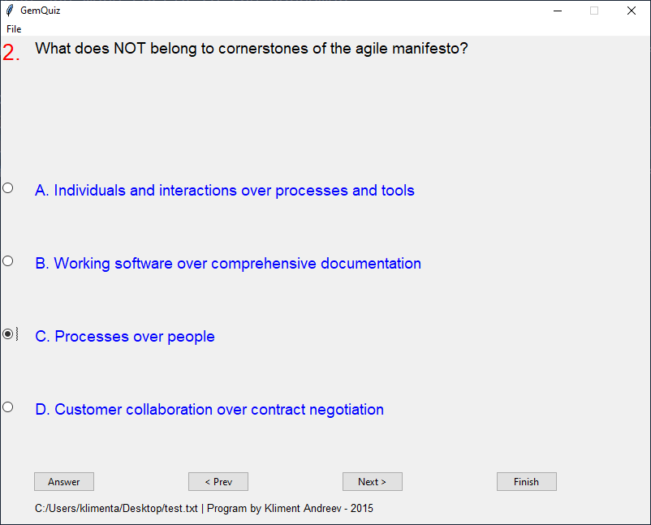

# GemQuiz

I made this small program when I was playing with Ruby and Tk. You'll need Tk installed in order to get the GUI.
The program is a very primitive quiz type of a program. When the program starts, click on **File | Open** and select a text file with the questions and answers. A sample quiz with 5 questions is provided (test.txt).
At the end you'll get how many questions you guessed correctly and the percentage overall.

The quiz has to be in the following format, no blank lines are allowed                                        
                                                                                                              
Question number                                                                                               
Question text (one continuous line, the program takes care of the wrapping)                                   
Four possible answers, each line starts with A., B., C. and D.                                                
Answer(s) line that starts with the words "Answer: " (no quotes) and the correct answer                       
     The program takes care of single/multiple choice answer widgets                                          

e.g.                                                                                                          

Q1.                                                                                                           
Leveraged loans are loans provided to companies that already have a significant amount of outstanding debt.   
As a banker, how might you compare a leveraged loan to other loans in your portfolio?                         
A. Higher risk to the lender but less costly to the borrower.                                                 
B. Lower risk to the lender and less costly to the borrower.                                                  
C. Lower risk to the lender but more costly to the borrower.                                                  
D. Higher risk to the lender and more costly to the borrower.                                                 
Answer: D                                                                                                     

This example will create a quiz with 4 radio buttons. If the answer line was Answer: B,C then the program will show four check buttons instead.                                                        

**NOTE:** The question in this example is two lines. In the file, it should be one continuous line

**NOTE:** Do not leave ANY blank lines.
